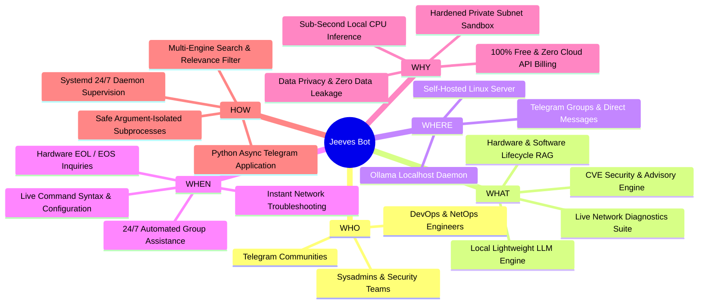

# 🤖 Jeeves: Lightweight AI & Live Network Diagnostics Bot

> An engineering-grade Telegram assistant powered by a local lightweight LLM (Qwen 2.5 / Llama 3.2 via Ollama) and a live suite of network diagnostic tools.

[](https://t.me/pgjeevesbot)
[](https://python.org)
[](https://ollama.com)
[](LICENSE)

---

## 🧭 The 5 W's and H Framework



---

### 1. 👤 WHO is Jeeves for?
* **Network & Systems Engineers:** Quickly run pings, port scans, DNS lookups, route traces, and SSL checks directly from a mobile phone or group chat without opening a terminal.
* **Infrastructure & Security Teams:** Instant retrieval of vendor CLI syntax (FortiOS, Cisco, Junos, Linux), CVE security advisories, and hardware/software End-of-Life (EOL/EOS) dates.
* **Telegram Group Communities:** A fast, non-intrusive assistant that answers technical questions, provides Wikipedia references, and prevents group chat spam by only responding when mentioned (`@pgjeevesbot`) or replied to.

---

### 2. 📦 WHAT is Jeeves?
Jeeves is a multi-purpose Telegram bot built with a dual-engine architecture:

#### A. Local AI Brain (Ollama)
* Powered by lightweight, 4-bit quantized open-source models: **`qwen2.5:1.5b`** (default) or **`llama3.2:1b`**.
* Runs locally on CPU with zero cloud API tokens or external billing.
* Strict system prompts enforce structured technical outputs, CLI code blocks, and zero conversational fluff.

#### B. Technical Intelligence & RAG Pipeline
* **Hardware Lifecycle & Specs:** Automatically parses and tracks datasheets for FortiGate, Cisco, HPE, Dell, and Ubiquiti appliances.
* **Software Lifecycle & Upgrades:** Tracks release dates, End of Engineering Support (EOES), EOL dates, and safe upgrade paths for FortiOS, VMware ESXi, Ubuntu, RHEL, and Windows Server.
* **CVE Security Lookups:** Queries vulnerability severity, CVSS scores, affected versions, and official mitigation workarounds.
* **Movie & TV Metadata Extraction:** 
  * **`/movie <title>`** — Extracts `{id}` (IMDb `tt...` or TMDB ID).
  * **`/tv <title> [season] [episode]`** — Extracts `{id}`, `{season}`, and `{episode}` (e.g. `/tv Breaking Bad s02e05` or `/tv The Boys 3 2`).
* **Dual-Layer Wikipedia Search:** Validates keyword relevance before summarizing topics, with direct reference link citations.
* **Fallback AI Reasoning:** Solves math, regional currency conversions (e.g. PGK, AUD, PHP), and commodity rates using direct internal reasoning without fake links.

#### C. Live Network Diagnostics Suite
Executes live terminal diagnostics safely on the host server and formats results in monospace Markdown:
* **`/ping`** — ICMP ping with latency statistics (min/avg/max).
* **`/traceroute`** *(or `/trace`)* — Multi-hop route tracing.
* **`/dns`** *(or `/dig`)* — DNS record queries (`A`, `AAAA`, `MX`, `TXT`, `NS`, `CNAME`).
* **`/nmap`** *(or `/portscan`)* — Fast non-intrusive scan of top 16 common ports.
* **`/whois`** — Domain registration and WHOIS records.
* **`/http`** *(or `/curl`)* — HTTP status, response headers, and redirect chains.
* **`/ssl`** *(or `/cert`)* — SSL certificate issuer, validity, and expiry dates.
* **`/ipinfo`** *(or `/ip`)* — IP geolocation, country, ISP, and ASN information.

---

### 3. 📍 WHERE does it run?
* **Hosting Environment:** Runs on any Linux server (e.g. DigitalOcean Droplet, Ubuntu 22.04/24.04, Debian) with minimal resource requirements (4 vCPUs, 8 GB RAM, CPU-only).
* **Inference Endpoint:** Local Ollama daemon running on `127.0.0.1:11434`.
* **Client Interface:** Accessible globally across Telegram on mobile, desktop, and web.

---

### 4. ⏰ WHEN should you use it?
* **On-Call & Triage:** When you need to check if a remote server, port, or SSL certificate is down while on the go.
* **Group Architecture Discussions:** When colleagues ask for configuration snippets, upgrade paths, or datasheet specifications in a group chat.
* **24/7 Operations:** Runs continuously as a systemd background service that automatically recovers after server restarts.

---

### 5. 💡 WHY was Jeeves built?
| Challenge | Traditional Approach | Jeeves Solution |
| :--- | :--- | :--- |
| **Cost** | Expensive OpenAI / Anthropic per-token API billing | **100% Free** local open-weight model |
| **Speed** | Cloud API network latency & rate limits | **~1-2s local CPU inference** |
| **Privacy** | Sensitive queries sent to cloud providers | **100% Private** on your server |
| **Security** | Vulnerable to command injection | **Argument-isolated execution + RFC1918 sandbox** |
| **Group Spam** | Bots that reply to every message | **Privacy mode + mention-only group triggers** |

---

### 6. ⚙️ HOW does it work?

#### Architecture & Project Layout

```
jeeves/
├── bot.py                  # Main Telegram bot entrypoint
├── config.py               # Central configuration & environment loader
├── requirements.txt        # Python package dependencies
├── .env.example            # Environment variables template
├── .gitignore              # Git exclusion rules
├── README.md               # 5 W's and H documentation
├── LICENSE                 # MIT License
│
├── services/               # Core business logic & AI/RAG services
│   ├── __init__.py
│   ├── llm_engine.py       # Ollama LLM client & prompt engine
│   ├── network_tools.py    # Live network diagnostics & IP sandbox
│   ├── technical_service.py# CLI syntax, CVEs & tech routing
│   ├── hardware_service.py # Datasheet & hardware EOL tracking
│   ├── software_service.py # OS/firmware upgrade paths & EOES
│   ├── flight_service.py   # Flight routes and aviation schedule search
│   ├── persona_service.py  # VIP handling and bot persona
│   ├── profile_service.py  # User profiling, tone & sentiment assessment
│   ├── movie_service.py    # Movie & TV show IMDb ID / TMDB ID lookup
│   ├── wiki_service.py     # Wikipedia search with relevance filter
│   └── search_service.py   # Multi-engine web search fallback
│
├── data/                   # Data files, inventory, and user profiles
│   ├── hardware.txt        # Tracked hardware appliances
│   ├── software.txt        # Tracked software & OS versions
│   └── user_profiles.json  # Behavioral profiles & interaction history
│
├── systemd/                # Linux service definition & installer
│   └── telegram-bot.service
│
└── tests/                  # Test suites and diagnostic verification scripts
    ├── __init__.py
    ├── test_engine.py
    ├── test_network_tools.py
    ├── test_hardware_and_search.py
    ├── test_software_pipeline.py
    ├── test_technical_pipeline.py
    ├── test_profile_service.py
    └── test_movie_pipeline.py
```

#### Architecture Flow

```mermaid
flowchart TD
    subgraph Telegram_Client [Telegram User Interface]
        U1[Group Mention: @pgjeevesbot]
        U2[Direct Command: /ping, /nmap, /dns]
        U3[AI Query: /ask & Direct Messages]
    end

    subgraph Bot_Application [Telegram Bot Layer - bot.py]
        Router{Command Router}
        U1 --> Router
        U2 --> Router
        U3 --> Router
    end

    subgraph Network_Engine [Network Diagnostic Engine - services/network_tools.py]
        Sandbox{Security & IP Sandbox}
        Subproc[Safe Subprocess Execution\nArgument List / Timeout Bound]
        Blocked[⚠️ Reject Private / Loopback IPs]
    end

    subgraph AI_Engine [Technical Intelligence & LLM - services/llm_engine.py]
        TechService[Technical & Lifecycle RAG]
        WikiService[Wikipedia Keyword Relevance Filter]
        Ollama[Ollama Inference Daemon\nQwen 2.5 1.5B @ 127.0.0.1:11434]
    end

    Router -->|Network Tool| Sandbox
    Sandbox -->|Public IP/Host| Subproc
    Sandbox -->|127.0.0.1, 10.x, 192.168.x| Blocked
    Subproc -->|Raw Monospace Output| Telegram_Client
    Blocked --> Telegram_Client

    Router -->|General / Tech Query| TechService
    TechService --> WikiService
    TechService --> Ollama
    Ollama -->|Structured Technical Markdown| Telegram_Client
```



---

## 🚀 Quick Setup & Installation

### 1. Prerequisites
* Linux OS (Ubuntu 22.04/24.04 or Debian)
* Python 3.10+
* Ollama installed

### 2. Clone & Install Dependencies
```bash
git clone https://github.com/pngflaver/jeeves.git
cd jeeves

# Create and activate Python virtual environment
python3 -m venv venv
source venv/bin/activate

# Install requirements
pip install -r requirements.txt

# Install CLI network tools
sudo apt-get update && sudo apt-get install -y nmap traceroute whois bind9-dnsutils curl openssl
```

### 3. Setup Local LLM Engine (Ollama)
```bash
# Install Ollama
curl -fsSL https://ollama.com/install.sh | sh

# Pull the lightweight model
ollama pull qwen2.5:1.5b
```

### 4. Configure Environment Variables
Copy `.env.example` to `.env`:
```bash
cp .env.example .env
```
Edit `.env` and insert your token from [@BotFather](https://t.me/BotFather):
```env
TELEGRAM_BOT_TOKEN=123456789:ABCDefghIJKlmNoPQRsTUVwxyZ
OLLAMA_MODEL=qwen2.5:1.5b
MAX_RESPONSE_TOKENS=600
TEMPERATURE=0.4
```

### 5. Start the Bot Service

#### Run Interactively for Testing:
```bash
./venv/bin/python bot.py
```

#### Run 24/7 via Systemd (Recommended):
```bash
sudo cp systemd/telegram-bot.service /etc/systemd/system/
sudo systemctl daemon-reload
sudo systemctl enable --now telegram-bot

# Check logs
journalctl -u telegram-bot -f
```

---

## 🔒 Security Architecture

1. **Subprocess Isolation:** Commands are executed strictly through `asyncio.create_subprocess_exec` with explicit parameter lists (never `shell=True`), preventing shell command injection attacks.
2. **RFC1918 & Cloud Metadata Filter:** Automatically intercepts and blocks commands targeting:
   * Loopback: `127.0.0.0/8`, `localhost`
   * Private subnets: `10.0.0.0/8`, `172.16.0.0/12`, `192.168.0.0/16`
   * Link-local & Cloud Metadata: `169.254.0.0/16` (`169.254.169.254`)
3. **Execution Guardrails:** Hard timeouts (5–20s) ensure high availability and prevent resource starvation.

---

## 🧪 Running Test Suites

Execute any of the test modules from the project root:

```bash
# Test network diagnostic tools & security sandbox
python tests/test_network_tools.py

# Test technical CLI & CVE pipeline
python tests/test_technical_pipeline.py

# Test software lifecycle & EOL pipeline
python tests/test_software_pipeline.py

# Test hardware tracking & web search
python tests/test_hardware_and_search.py

# Test AI engine & Wikipedia search
python tests/test_engine.py
```

---

## 📄 License
Released under the [MIT License](LICENSE).
